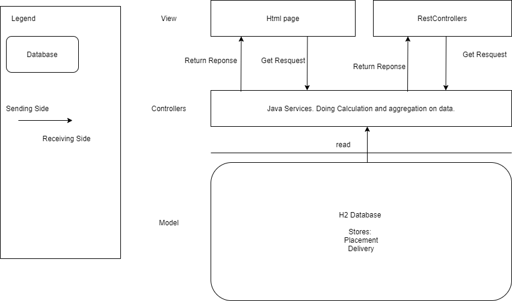

# Delivery Parsing 
## Design Overview

Based on the description, there are models need to be stored and perform calculation on it, also present the result. It is a good use case of MVC pattern. 



## Programming Language And Framework

Picked Java and SpingBoot framework. 

Java is OOP language, good fit when there is requirement to implement object behaviors. 

SpringBoot offers range of easy-use tools such as Hibernate, Thymeleaf. It is time saving approach to implement a full stack project within short time period.

## How to run

Clone the git bundle repo.
```
git clone deliveryParsing ./delivery-parsing
```

The project is developed in Intellij IDE. If you open the code repo with Intellij,  there is existing configuraiton to run the application. Automated unit tests are located in the test folder. 

1. Right click on the test folder to run the tests within IDE. 
2. Use maven to run test cases. Open the maven tab, click the verify command to run. 

### Run the application

After the maven dependency is installed automatically in the IDE, click the run button with the provided run configuration on the top of the IDE. 

1. Access the default report RestFul APi:
    Can use Postman, issue a GET call on `http://localhost:8808/report`.

2. Access the WebUi. Can open website on `http://localhost:8808/index`. There is a datepicker to pick a date range, further generate the date range report. 
Also there is a generate button to generate the default report. 

## Extendable functionality. 
- Url query parameter deletion 
    
    Currently the webpage is not updaing the url to exclude the query parameters after a request is sent. I did not polish this part due to time constraint and not a requirement. In terms of user friendly ux, it would be better to implement the feature.


## Approaches Open to discuss

- Use JPA derived query vs customized result query

    Both approaches are used in the application to show the difference and benefit between each other. 

    Using customized result can take the use of database to do aggregation caclculation, minimize the possibility of overflow the memory when loading too many records from database. 

    However, customized query result does not have the refactor flexibility. For example, when the class name or member name changed, there will be a manual update required in the query. 

    Using derived query to load records to JVM, and do calculation in memory would have a risk of memory overflow. Can be solved by pagination if required. 

    On the constrast, the derived query does not require a manual update on query when any change is performed on the entity name and members.


## Disclaimer

The Centro trademark used is only for demo purpose. No commercial usage is applied to it.

